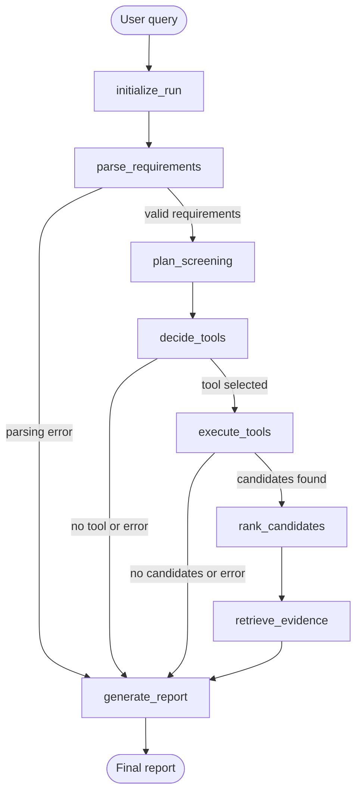

# MatAgent-WBG

MatAgent-WBG is a lightweight, tool-using scientific Agent for screening
wide-bandgap semiconductor materials. It combines LLM reasoning, validated tool
calls, Materials Project data, scientific RAG, persistent LangGraph state, and a
citation-checked final report without local models, a GPU, or a large dataset.

## Features

- Natural-language requirements parsed into strict Pydantic objects.
- LangGraph planning, routing, state, traces, and SQLite checkpoints.
- DeepSeek structured output and allow-listed function calling.
- Materials Project search with deterministic scientific filters and ranking.
- Semantic Scholar abstracts, hosted BGE-M3 embeddings, and Supabase pgvector RAG.
- Evidence-grounded reports that reject unknown candidates and DOI values.
- Offline fallback, lightweight FastAPI UI, tests, and retrieval metrics.

This is intentionally one auditable workflow Agent. The LLM handles language,
tool selection, and communication; scientific filters and ranking remain code.

## Workflow



Each stage writes to `tool_history`; invalid tools, arguments, API data, and
citations are rejected before the final answer.

## Project structure

```text
matagent/
├── cli.py / web.py        # CLI and lightweight FastAPI entry points
├── runtime.py             # Shared dependency wiring for both entry points
├── graph.py               # LangGraph assembly and routing
├── schemas.py / state.py  # Validated contracts and shared Agent state
├── citations.py           # Shared DOI normalization
├── persistence.py         # SQLite checkpoint helpers
├── llm/                   # Offline + DeepSeek reasoning components
├── tools/                 # Tool registry and scientific adapters
├── workflow/              # Planning, ranking, RAG, and reporting nodes
├── rag/                   # Supabase, embedding, ingestion, and literature clients
├── evaluation/            # Retrieval metrics
└── static/                # Dependency-free browser UI

sql/                       # Three idempotent Supabase setup scripts
tests/                     # Network-free unit and workflow tests
mock_materials.json        # Explicitly illustrative offline data
```

## Install

Python 3.10+ is supported. On the existing laptop environment:

```powershell
conda activate agentenv
python -m pip install --no-cache-dir -r requirements.txt
```

Copy `.env.example` to `.env` and add keys locally. `.env` is ignored by Git.

```powershell
Copy-Item .env.example .env
notepad .env
git check-ignore .env
```

Required keys depend on the selected features:

| Feature | Setting |
|---|---|
| DeepSeek reasoning and final synthesis | `MATAGENT_LLM_API_KEY` |
| Materials Project search | `MATAGENT_MP_API_KEY` |
| Literature discovery | `MATAGENT_S2_API_KEY` |
| Hosted BGE-M3 embeddings | `MATAGENT_EMBEDDING_API_KEY` |
| Supabase RAG | `MATAGENT_SUPABASE_URL`, `MATAGENT_SUPABASE_SECRET_KEY` |

Never put secrets in source code, CLI arguments, state, traces, or commits.

## Run

Fast, free, deterministic smoke test:

```powershell
python -m matagent.cli --mode offline --material-backend mock --show-trace `
  "寻找带隙大于3 eV、适合高温功率器件并优先考虑高热导率的材料"
```

Complete real-data Agent run:

```powershell
python -m matagent.cli --mode deepseek `
  --material-backend materials-project --fetch-limit 100 --report-limit 10 `
  --rag --evidence-top-k 2 --show-trace `
  "寻找带隙大于3 eV、适合高温功率器件并优先考虑高热导率的材料"
```

DeepSeek handles requirement parsing, tool selection, and grounded synthesis.
Failures fall back to a deterministic report with an explicit diagnostic.

## RAG

Run these files in the Supabase SQL Editor, in order:

1. `sql/001_supabase_rag.sql` — restricted health RPC;
2. `sql/002_rag_evidence_store.sql` — documents, chunks, HNSW index, search RPC;
3. `sql/003_rag_ingestion.sql` — DOI-idempotent atomic ingestion RPC.

Then verify the two external layers without printing secrets or vectors:

```powershell
python -m matagent.rag.check_database
python -m matagent.rag.check_embedding
```

Build a reviewed corpus with a dry-run first:

```powershell
python -m matagent.rag.literature_cli bootstrap `
  --material Diamond --material AlN --material beta-Ga2O3 `
  --material 4H-SiC --material GaN `
  --papers-per-material 2 --search-limit 10
```

The planner requires DOI-backed abstracts, checks material mentions and year,
respects rate limits, retries HTTP 429, and deduplicates by DOI. Review the
preview, then repeat with `--write`. Supabase stores the abstracts and their
1024-dimensional vectors; PDFs are not downloaded.

## Checkpointing

```powershell
python -m matagent.cli --mode offline --thread-id demo-001 `
  --show-checkpoints "寻找高温功率半导体材料"
```

The default `.matagent/checkpoints.sqlite3` stores isolated workflow state and
history, never API keys.

## Web interface

The browser UI uses the same runtime as the CLI and keeps API keys server-side.

```powershell
python -m uvicorn matagent.web:app --host 127.0.0.1 --port 8000
```

Open `http://127.0.0.1:8000`; API docs are at `http://127.0.0.1:8000/docs`.
The UI has no authentication, so keep it bound to localhost for development.

## Tests

Tests use fake HTTP and LLM clients and make no paid calls:

```powershell
python -m unittest discover -s tests -v
```

`matagent.evaluation.evaluate_retrieval` computes retrieval metrics from reviewed
query/DOI labels.

## Scientific boundaries

- Mock values are demonstration-only; Materials Project values are computed
  screening data, not device guarantees.
- The live backend does not currently provide thermal conductivity or breakdown
  field; missing properties are never fabricated or silently ranked.
- Retrieved abstracts support traceability but do not replace full-paper review.
- Evidence count is not a performance score. Manufacturability, defects, doping,
  contacts, cost, and uncertainty remain outside this screening stage.
